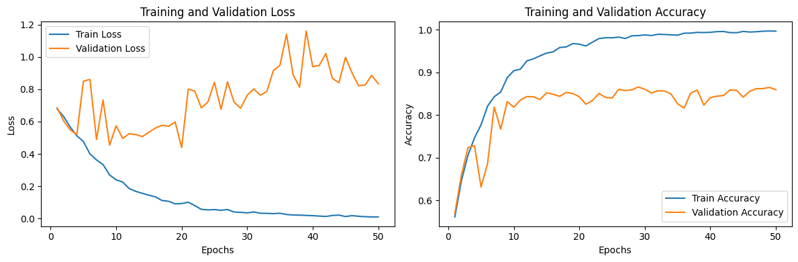
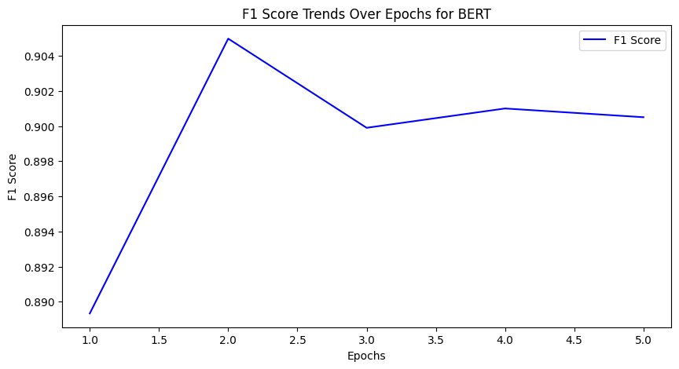

# Sentiment Analysis using LSTM and BERT

This repository contains code for sentiment analysis using two different models: LSTM (Long Short-Term Memory) and BERT (Bidirectional Encoder Representations from Transformers). The code is written in Python and uses the PyTorch library for LSTM and the Huggingface Transformers library for BERT.

## LSTM Sentiment Analysis

### Objectives
- Design an LSTM-based text classification model from scratch using PyTorch.
- Apply the LSTM model to sentiment analysis.
- Use Huggingface Library (`transformers`) to leverage self-supervision via large language models.

## Download Train Dataset

The training dataset is automatically downloaded from the following link:
[Download Training Dataset](https://raw.githubusercontent.com/dongkwan-kim/small_dataset/master/review_10k.csv)

## Environment Setting

Make sure to install the required packages by running the following command:
```bash
pip install transformers[torch] datasets evaluate accelerate -U
```

## LSTM Implementation

The LSTM model is implemented in the `RNN` class in the `lstm.py` file. The training and evaluation processes are defined in the `train` and `evaluate` functions. You can customize the hyperparameters and set your own values in the `set_hyperparameter_for_LSTM` function.

To run the LSTM model, execute the following code:
```python
from lstm import set_hyperparameter_for_LSTM, run_LSTM

param_dict = set_hyperparameter_for_LSTM()
run_LSTM(param_dict)
```

## BERT Sentiment Analysis

### Objectives
- Utilize the Huggingface Library for sentiment analysis using BERT.
- Evaluate the BERT model on the sentiment analysis task.

## BERT Implementation

The BERT model is implemented in the `run_BERT` function in the `bert.py` file. Hyperparameters for BERT are set in the `set_hyperparameter_for_BERT` function.

To run the BERT model, execute the following code:
```python
from bert import set_hyperparameter_for_BERT, run_BERT

args = set_hyperparameter_for_BERT()

```

Note: The BERT model uses the DistilBERT architecture with the `'distilbert-base-cased'` pre-trained model.

## Results
<div style="display:flex;">
    <div style="width:100%; text-align:center;">
        
        <p style="margin: 0 auto;">(a) Loss and Accuracy Trends for LSTM</p>
    </div>
    <div style="width:100%; text-align:center;">
        
        <p style="margin: 0 auto;">(b) F1 Trends for BERT</p>
    </div>
</div>

The LSTM model achieved a validation accuracy of 81.84%, while the BERT model demonstrated a F1 score of 90.05% on sentiment analysis.

